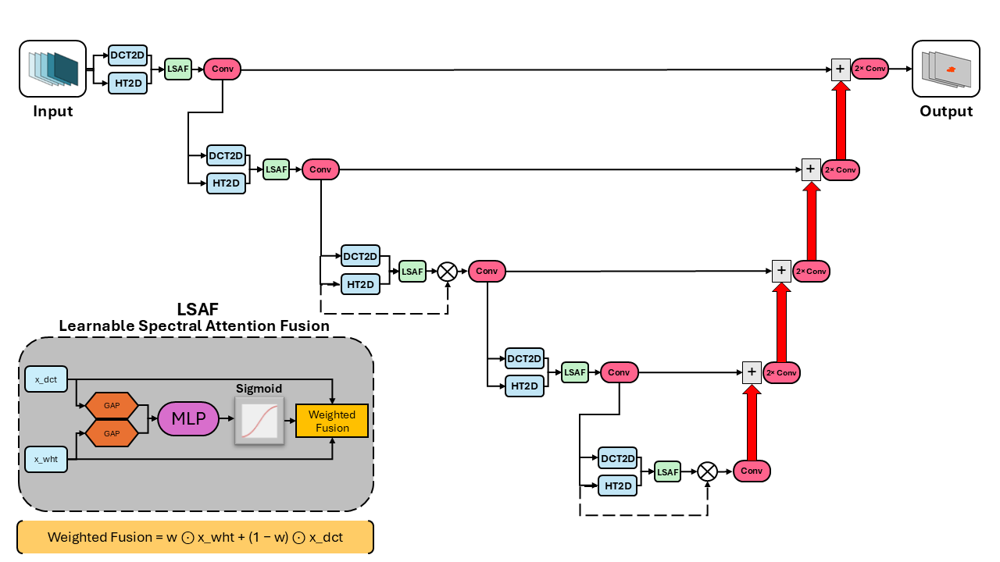

# HT/DCT-Enhanced UNet for Next-Day Wildfire Spread Prediction

This project develops several **Hadamard Transform (HT)** and **Discrete Cosine Transform (DCT)** enhanced **UNet-based architectures** for **next-day wildfire spread prediction**.

The models are trained and evaluated using the **Next Day Wildfire Spread** dataset introduced in:

F. Huot, R. L. Hu, N. Goyal, T. Sankar, M. Ihme, and Y.-F. Chen,  
*“Next Day Wildfire Spread: A Machine Learning Dataset to Predict Wildfire Spreading From Remote-Sensing Data,”*  
**IEEE Transactions on Geoscience and Remote Sensing**, vol. 60, pp. 1–13, 2022, Art. no. 4412513.  
DOI: 10.1109/TGRS.2022.3192974

***

## Dataset

The modified Next-Day Wildfire Spread dataset is obtained from Kaggle:

https://www.kaggle.com/datasets/georgehulsey/modified-next-day-wildfire-spread/data

***

## Repository Structure
- `data/` for storing downloaded dataset
- `dataset/`
- `models/`
- `train_*.py`
- `README.md`

***

## Dataset Preprocessing (`/dataset`)

### Core Dataset Files

- **constants.py**  
  Defines global constants (feature names, normalization parameters, etc.).  
  Adapted from the original project.

- **dataset.py**  
  Core dataset loader inherited from the original implementation.

***

### Customized Preprocessing

- **dataset_adjust_pre_post_gaussian.py**  
  Applies customized preprocessing:
  - Random cropping on the pre-fire mask
  - Revises ground truth from next-day post-fire mask to both-day (pre + post) fire mask
  - Applies Gaussian mixture modeling to:
    - Wind features
    - Pre-fire mask features

- **pre_gaussian.py**  
  Auxiliary file defining the Gaussian Mixture Model (GMM), imported by  
  `dataset_adjust_pre_post_gaussian.py`.

- **pre_gaussian_tf.py**  
  TensorFlow implementation of Gaussian preprocessing for AECNN pipelines.

***

### Visualization

- **data_plot.py**  
  Plots dataset samples for qualitative visualization.

***

## Models (`/models`)

### Baseline Model
- **lite_unet_dct_wht_shearlet.py**
  A U-Net architecture enhanced with multi-domain feature extraction using DCT, WHT, and cone-adapted digital Shearlet transforms. DCT and WHT representations are extracted in parallel and adaptively fused through a Learnable Spectral Attention Fusion (LSAF) module, while learnable Shearlet residual branches provide complementary directional and anisotropic feature modeling. The architecture integrates spectral, spatial, and directional information throughout the encoder and bottleneck stages, improving representation capacity and training stability.
  

  
  

- **lite_unet_dct_wht_residual.py**
  A U-Net architecture enhanced with dual spectral-domain feature extraction using the Discrete Cosine Transform (DCT) and Walsh–Hadamard Transform (WHT) at every encoder stage. The     transformed features are adaptively fused through a Learnable Spectral Attention Fusion (LSAF) module, which dynamically combines complementary frequency-domain representations        before convolutional processing. The network also incorporates residual connections at the third encoder stage and the bottleneck layer to improve feature propagation and training     stability.
  

  
  

- **cnn_autoencoder_model.py**  
  Original AECNN (CNN Autoencoder) model used in the Google wildfire prediction paper.

- **model_utils.py**  
  TensorFlow model utility blocks used in the AECNN pipeline.

***

### Fully Integrated OT-UNet (HT-UNet)

- **hadamard_unet_BN_dropout_DEEP_v0.py**  
  Five-stage fully integrated HT-UNet architecture (shown in presentation slides).

- **hadamard_unet_BN_dropout_DEEP_v1_trainable.py**  
  Variant with trainable Hadamard transform matrices.

- **HT_FCB.py**  
  Model variant combining Hadamard transform blocks with fully connected layers.

***

### OT-Enc-UNet (Encoder-Domain Transform)

- **light_unet.py**  
  Baseline LiteUNet model.

- **DCT-based Implementation**
  - `light_unet_dct_selective_optional_compression2.py`

- **HT-based Implementation**
  - `light_unet_wht_selective2.py`

***

### OT-Trans-UNet (Transformer-Enhanced)

- **DCT-based Transformer UNet**
  - `light_unet_dct_selective_optional_compression2_transformer.py`

- **HT-based Transformer UNet**
  - `light_unet_wht_selective2_transformer.py`

***

## Losses and Metrics

- **losses.py**  
  Original loss definitions.

- **losses1.py**  
  Updated loss file with **Combo Loss** definition.

- **metrics.py**  
  Evaluation metrics (IoU, Precision, Recall, F1-score, etc.).

***

## Training Scripts

Before training, select the desired model import and adjust hyperparameters accordingly.

- **train_dct_unet.py**  
  Training script for:
  - DCT-Enc-UNet
  - DCT-Trans-UNet

- **train_wht_unet.py**  
  Training script for:
  - HT-Enc-UNet
  - HT-Trans-UNet

- **train_hadamard_unet.py**  
  Training script for fully integrated HT-UNet models.

- **train_tf_aecnn.py**  
  Training script for the original AECNN model.

- **train_tf_aecnn_apply_pre_processing.py**  
  Trains AECNN with customized Gaussian preprocessing applied.

***

## Notes

- All HT/DCT blocks operate on power-of-two spatial resolutions.
- Gaussian preprocessing is optional and configurable.
- Both PyTorch and TensorFlow environments are required (use conda activate tf_env on the lab Linux computer).

